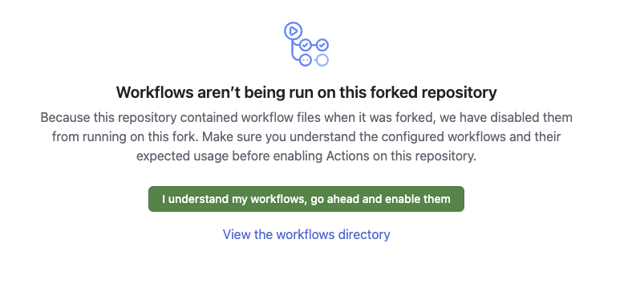

# Instructor Guide — deploy this for your school

`classroom` (this repo, **public**) + `classroom-admin` (**private**) are an issue-driven GitHub
Classroom replacement: students open a pre-filled Issue, an Action provisions a private repo from a
template, and you get a who-has-what report. To run it for **your** school, fork both templates and
do the one-time setup below.

> README.md = the **student**-facing page. This file = the **instructor/deployer** setup.

---

## 1. Fork the two templates into your org

| Template (canonical, in `gh-classroomless`) | Your fork | Visibility |
|---|---|---|
| `gh-classroomless/classroom-template` | `<your-org>/classroom` | public |
| `gh-classroomless/classroom-admin-template` | `<your-org>/classroom-admin` | private |

Use GitHub's **Fork** button (set the owner to your org), or the CLI:
```bash
gh repo fork gh-classroomless/classroom-template       --org <your-org> --fork-name classroom       --clone=false
gh repo fork gh-classroomless/classroom-admin-template --org <your-org> --fork-name classroom-admin --clone=false
```
Fork (not "Use this template") so you can later pull our code fixes — see **Updating** below.

## 2. ⚠️ Enable workflows — a fork starts with Actions DISABLED

Because the repo had workflow files when forked, GitHub disables them on your fork until you approve.
Open each repo's **Actions** tab and click the green button. **Nothing runs until you do this.**



Do it on **both** `<your-org>/classroom` **and** `<your-org>/classroom-admin`.

## 3. Add your `config.json`

Each school carries exactly **one** `config.json` at the repo root — its courses and assignments.
Copy `config.example.json` to `config.json` and fill it in (edit on the GitHub web UI, or clone).
On every push to `config.json`, the **gen-forms** Action rebuilds the `request-<course>.yml` forms
automatically — so a request form exists for each course you list.

```jsonc
{
  "instructor_username": "your-login",
  "courses": {
    "cs101": {
      "semester": "sp26",
      "assignments": {
        "A00": "cs101-template-repo-name",                 // normal: value = the template repo to clone
        "Q1":  { "template": "cs101-exam-repo",            // exam: time-gated
                 "available_from": "2026-06-29T00:00:00-07:00",
                 "available_until": "2026-08-15T23:59:59-07:00" }
      },
      "student_repo_pattern": "cs101-{semester}-{assignment}-{username}"
    }
  }
}
```
Assignment **template repos** (the code/tests students get) live in **your org**, not here.

## 4. Secrets (on `<your-org>/classroom`)

```bash
gh secret set JOIN_CODE --repo <your-org>/classroom    # your class join code (students enter it to register)
gh secret set ORG_PAT   --repo <your-org>/classroom    # a classic PAT: scopes repo + read:org + admin:org
```
`ORG_PAT` lets the workflows create student repos, add the student as a collaborator, and write the
private admin repo. Never put these in `config.json` (it's public).

## 5. How `classroom` ↔ `classroom-admin` are linked

- **By name:** workflows write to `${{ github.repository }}-admin` — so the private repo **must** be
  named `<your-org>/classroom-admin` (matching the public `<your-org>/classroom`).
- **By token:** they reach it with `ORG_PAT` (step 4).
- **PII boundary:** student name/email + the report live **only** in the private admin repo. The
  public `classroom` repo holds no PII.

## 6. Post the Canvas deep-links (per course)

```
Register: https://github.com/<your-org>/classroom/issues/new?template=01-register.yml&join_code=<CODE>
Request:  https://github.com/<your-org>/classroom/issues/new?template=request-<course>.yml
My repos: https://github.com/<your-org>/classroom/issues/new?template=03-myrepos.yml
```

## Updating later (you're a fork)

When the upstream template ships a code fix, pull it — your `config.json` and generated forms are
preserved (the upstream doesn't contain them, so a merge can't touch them):
```bash
# "Sync fork" button on the repo, or:
git pull https://github.com/gh-classroomless/classroom-template.git main
git push
```

## The dashboard

On `<your-org>/classroom-admin`: **Actions → report → Run workflow** → read `REPORT.md`.
